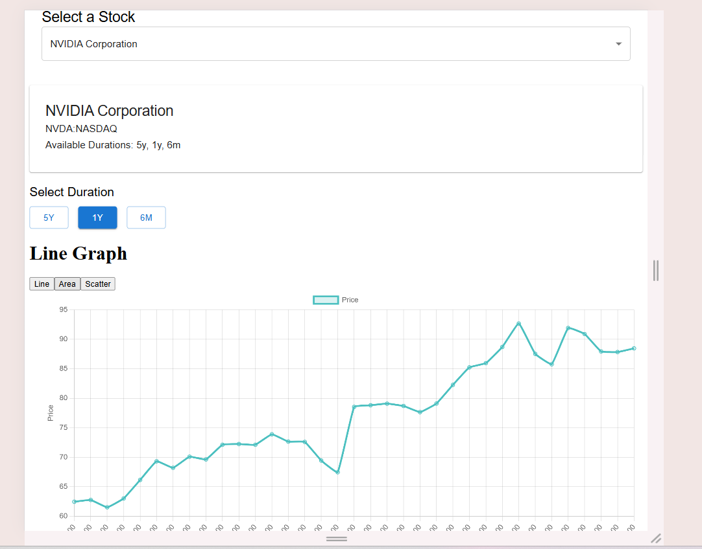
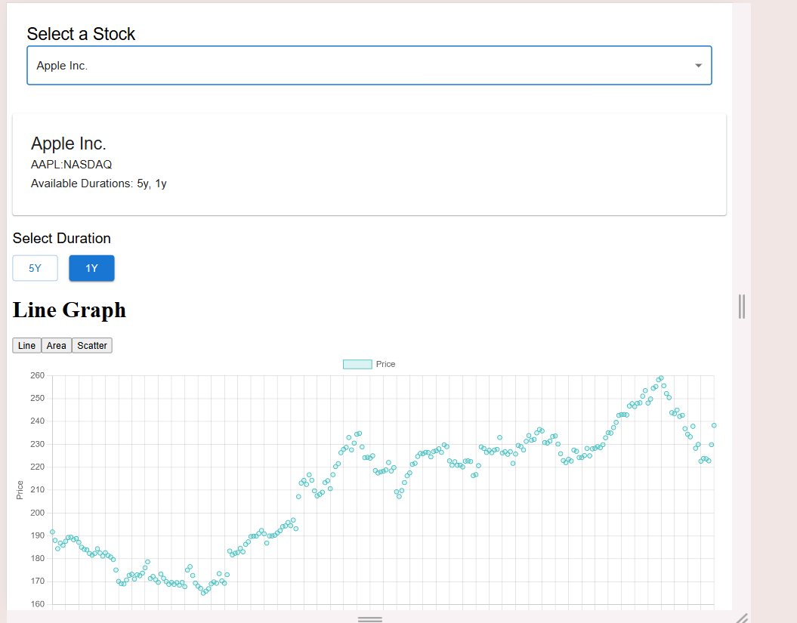

# Welcome to the alloan.ai frontend intern challenge!

> This is an opening for the frontend engineer intern position at alloan.ai, a cutting-edge fintech startup building products for the asset-based securities market.  
> Ideally, you're comfortable with JS, TS and ReactJS, using React hooks as needed and Redux for state management.  

## Job description
This is a paid internship for a duration of 4-6 months. Ideally you're in your final year of college or have less than 1 year of experience. 
Location is flexible; generally remote, but might need you to travel to work together and get up to speed with the team. A typical workday spans 7 hours.
**Note: Application will be considered only on completion of this challenge.**
<details>
<summary>
More info
</summary>

### Who are we?
Alloan.ai is a cutting-edge fintech startup dedicated to building innovative solutions for the asset-backed securities market. Our diverse team of professionals from top institutions is disrupting the traditional financial landscape by leveraging advanced technology and data science.
Our mission is to make complex financial products more accessible, efficient, and transparent. 

### What are we looking for? 
A passionate and motivated Frontend Engineer Intern to join our growing engineering team.
As an intern, you will collaborate closely with experienced engineers to design and build intuitive, scalable, and responsive user interfaces using React. This is a unique opportunity to gain hands-on experience in a high-impact, fast-paced startup environment while contributing to cutting-edge fintech solutions. 

### Your key responsibilities will be to: 
- Collaborate with the founding team to shape and improve product features, contributing ideas and solutions to enhance the user experience. 
- Build and deploy new functionalities for our fintech products, ensuring performance, scalability, and responsiveness. 
- Write clean, maintainable, and well-documented code adhering to industry best practices and code quality standards. 
- Troubleshoot and resolve UI/UX issues, proactively suggesting enhancements to improve usability and design. 
- Participate in high-level and low-level system designs for features and workflows. 
- Commit to a minimum of 7 hours/day 
- Actively engage in code reviews, providing constructive feedback to maintain high code quality across the team. 

### Basic Qualifications 
- Strong proficiency in React.js, JavaScript, and TypeScript. 
- Expertise in state management with Redux Toolkit and Context API. 
- Expertise in React hooks such as useEffect, useCallback, and useMemo. 
- Experience with RestAPIs and building responsive designs. 
- Familiarity with react-router and navigation techniques. 
- Strong command of Git for version control and collaboration.

### Preferred Qualifications 
- Advanced experience with React hooks. 
- Familiarity with optimization techniques in React, including React.memo, code splitting, and performance monitoring. 
- Experience with Firebase Authentication and TOTP/Two-Factor Authentication. 
- Experience working with Chart.js or react-chartjs for data visualization. 
- Familiarity with utility libraries like lodash. 
- Familiarity with debounce, polling, cleanup and axios abort. 
- Basic understanding of backend technologies like Python, Flask, NoSQL, and SQL databases. 
- Hands-on experience building projects using Redux Toolkit, with an understanding of advanced concepts like thunk and slice. 
- Interest in fintech or financial markets. 

### Why join us?
- Impactful Work: Build dynamic fintech products that will deepen your understanding of the US lending market and its intricacies. Also get to learn from top lending investment firms. 
- Cutting-Edge Technology: Work on AI model integrations and gain hands-on experience with LLMs to enhance product intelligence and functionality. 
- Startup Culture: Experience an agile, dynamic environment where your contributions will directly influence our product’s direction. 
- Growth Potential: Opportunity to convert your internship into a full-time position based on performance and business needs. 
- Competitive Compensation: Get paid for your impactful contributions while working on innovative solutions in the fintech space.

</details>

## Goal
Build a responsive single-page frontend which shows dynamically updating stock graphs using the given API. 📈  
Should adhere to the requirements below but it needs only a few components. Use UI libraries of your choice!

## How do I submit?
- Fork this repo
- Implement the UI in the `frontend` folder in this repo
- Add instructions to run the UI in this readme 👇🏽
- ~~???Profit???~~ Send your resume and Github repo link to hiring@alloan.ai with your name in the subject or submit it on [our LinkedIn posting](https://www.linkedin.com/jobs/view/4137806064).

## The challenge 🧑🏽‍💻
There are 2 APIs in this repo you can run locally (instructions below).  
1. `GET /api/stocks`: list of stocks with durations for which data is available 
2. `POST /api/stocks/:id`: graph data for a specific stock

The second API simulates real-life data systems where data processing happens over time in the backend - meaning, it may require _multiple_ requests from the frontend to gather complete information.   
Eg.
- Request 1: responds with `{0 entries}`
- Request 2 after a little while: responds with `{some entries}`
- Request 3 after a little more while: responds with `{some more entries}`
- Request n after a little more little while: responds with `{all entries}`

### What we want to see (mandatory)
- A dropdown where the user can select a stock
- A way to switch between durations for the selected stock
- A graph for the selected stock and duration (remember the second API returns data over time - this graph should be updated dynamically)
- Make it responsive and look good!

### Tech constraints (mandatory)
- Use Redux Toolkit for managing global state, thunk for API calls
- Don't drill props beyond level 2
- Use pre-built components and libraries (we use MUI and react-chartjs, but you are free to use any lib of your choice)

### Brownie points (optional),
- if you can show multiple graphs at the same time
- if you can host it and share a link
- if you can add login with a basic 2FA implementation (we use Firebase!)

## Running services
### Instructions to run the UI
```bash
git clone https://github.com/amul69906995/test.git
cd frontend
npm i
npm run dev
```

### Add a demonstration video 
_make a demonstration video showcasing frontend not longer than 2-3min, just explain what you have done!_





[Watch the demonstration video](./assets/video-demo1.1.mp4)

### Instructions to run the backend API
```bash
cd backend
npm i
nodemon index.ts
```
